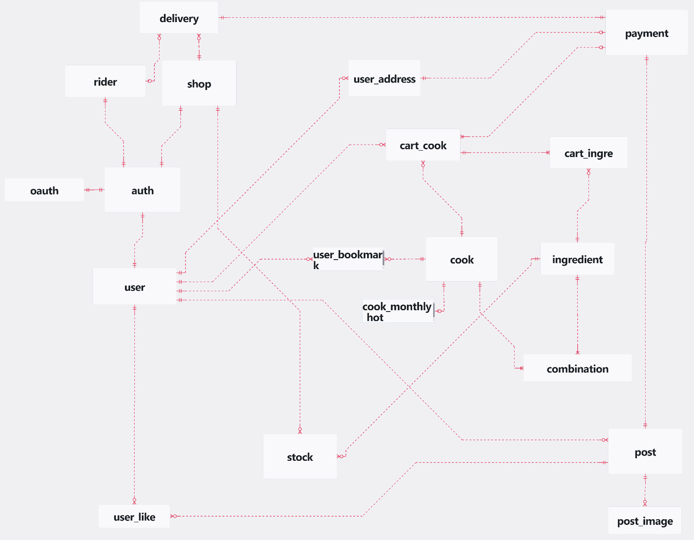

# 소복 Sobok : 식재료 큐레이션 배달 서비스

> **Team 3 - Microservices Architecture Food Delivery Platform**

SOBOK은 Spring Cloud 기반의 마이크로서비스 아키텍처로 구축된 식재료 큐레이션 배달 중개 플랫폼입니다. 고객, 가게 사장, 배달 라이더, 관리자의 다양한 역할을 지원하며, 실시간 배달 추적, 재고 관리, 커뮤니티 기능을 제공합니다.

## 📋 목차
- [팀소개](#팀소개)
- [프로젝트 개요](#프로젝트-개요)
- [시스템 아키텍처](#시스템-아키텍처)
- [기술 스택](#기술-스택)
- [마이크로서비스 구성](#마이크로서비스-구성)
- [주요 기능](#주요-기능)
- [설치 및 실행](#설치-및-실행)
- [API 문서](#api-문서)
- [데이터베이스 설계](#데이터베이스-설계)
- [보안](#보안)
- [모니터링](#모니터링)

## 👥 팀소개

**Team 3 - Full Stack Developers**
<br>
<br>
| 강하늘 <br> (Devy17) | 김현지 <br> (vbnmopas) | 한종균 <br> (HanJongKyun) | 김수영 <br> (SUEYOUNG14) | 유승현 <br> (youthdonut) |
| :----------: | :----------: | :----------: | :----------: | :----------: |
|  |  |  |  | 
| [https://github.com/Devy17](https://github.com/Devy17) | [https://github.com/vbnmopas](https://github.com/vbnmopas) | [https://github.com/HanJongKyun](https://github.com/HanJongKyun) | [https://github.com/SUEYOUNG14](https://github.com/SUEYOUNG14) | [https://github.com/youthdonut](https://github.com/youthdonut) |
| **Infra** | **Backend** | **Backend** | **Frontend** | **Frontend** |

- 백엔드 마이크로서비스 아키텍처 설계 및 구현
- Spring Cloud 기반 분산 시스템 구축
- RESTful API 설계 및 문서화

<br>

## 🎯 프로젝트 개요

### 비즈니스 도메인
- **고객**: 음식 주문, 배달 추적, 리뷰 작성
- **가게 사장**: 메뉴 관리, 주문 처리, 재고 관리
- **배달 라이더**: 배달 수행, 실시간 위치 추적
- **관리자**: 전체 시스템 관리, 사용자 승인

### 핵심 가치
- **확장성**: 마이크로서비스 아키텍처로 독립적 확장 가능
- **안정성**: 분산 락, 트랜잭션 관리로 데이터 일관성 보장
- **실시간성**: 위치 기반 배달 매칭, 실시간 상태 업데이트
- **사용자 경험**: 직관적인 API 설계, 종합적인 오류 처리

## 🏗️ 시스템 아키텍처

```
┌─────────────────┐    ┌─────────────────┐     ┌──────────────────┐
│   Client Apps   │────│  Gateway Service │────│ Discovery Service│
└─────────────────┘    └─────────────────┘     └──────────────────┘
                                │                       │
                       ┌────────┴────────┐              │
                       │  Config Server  │              │
                       └─────────────────┘              │
                                                        │
        ┌───────────────────────────────────────────────┴───────────────────────┐
        │                                                                       │
        ┌─────────────┐ ┌──────────────┐ ┌──────────────┐ ┌─────────────────┐   │
        │ Auth Service│ │ User Service │ │ Shop Service │ │ Payment Service │   │
        └─────────────┘ └──────────────┘ └──────────────┘ └─────────────────┘   │
        │                                                                       │
        ┌──────────────┐ ┌──────────────┐ ┌────────────────┐ ┌─────────────────┐│
        │ Cook Service │ │ Post Service │ │Delivery Service│ │   API Service   ││
        └──────────────┘ └──────────────┘ └────────────────┘ └─────────────────┘│
        │                                                                       │
        │        ┌─────────────────┐              ┌─────────────────┐           │
        │        │     MySQL       │              │     Redis       │           │
        │        └─────────────────┘              └─────────────────┘           │
        │                                                                       │
        └───────────────────────────────────────────────────────────────────────┘
```

## 🛠️ 기술 스택

### 백엔드 프레임워크
- **Spring Boot 3.3.13**: 마이크로서비스 기반 애플리케이션 프레임워크
- **Spring Cloud 2023.0.5**: 분산 시스템 구축을 위한 클라우드 네이티브 도구
- **Java 17**: 최신 LTS 버전의 자바 플랫폼

### 데이터 관리
- **JPA (Java Persistence API)**: 객체-관계 매핑(ORM) 표준
- **MySQL 8.0**: 관계형 데이터베이스, 영구 데이터 저장소
- **Redis 7.2**: 고성능 인메모리 데이터 저장소로, 캐싱, 세션 관리, 실시간 데이터 처리를 지원
  - **Redisson**: 분산 락, 캐시, 큐, 세마포어 등 고수준의 기능을 제공하는 Redis 클라이언트.
  - **Lettuce**: 넌블로킹, 리액티브 프로그래밍에 적합한 Redis 클라이언트로, Netty 기반의 비동기 처리 지원.
- **QueryDSL**: 타입 안전한 쿼리 생성 프레임워크

### 보안 및 인증
- **Spring Security**: 강력하고 유연한 인증 및 접근 제어 프레임워크
- **JWT (JSON Web Tokens)**: 토큰 기반 인증 및 권한 부여
- **SMS 인증**: CoolSMS를 통한 휴대폰 번호 인증

### API 및 모니터링
- **Swagger (OpenAPI 3.0)**: API 문서 자동 생성 및 테스트 인터페이스
- **Spring Boot Actuator**: 애플리케이션 상태, 메트릭, 환경 정보 모니터링
- **OpenFeign**: 선언적 HTTP 클라이언트, 마이크로서비스 간 통신

### 개발 편의성
- **Lombok**: 반복적인 코드 자동 생성으로 가독성 및 유지보수성 향상
- **JUnit & Spring Security Test**: 단위 테스트 및 통합 테스트 프레임워크
- **Docker Compose**: 개발 환경 컨테이너화

## 🔧 마이크로서비스 구성

### 인프라 서비스
| 서비스 | 포트 | 역할 | 주요 기능 |
|--------|------|------|-----------|
| **discovery-service** | 8761 | 서비스 레지스트리 | Eureka Server, 서비스 디스커버리 |
| **config-server** | 8888 | 설정 관리 | 중앙화된 설정 관리 |
| **gateway-service** | 8080 | API 게이트웨이 | 라우팅, 인증 필터, 로드 밸런싱 |

### 비즈니스 서비스
| 서비스 | 역할 | 주요 기능 |
|--------|------|-----------|
| **auth-service** | 인증/인가 | JWT 토큰 관리, SMS 인증, 사용자 등록 |
| **user-service** | 사용자 관리 | 프로필 관리, 주소 관리, 사용자 정보 |
| **shop-service** | 가게 관리 | 가게 정보, 재고 관리, 위치 기반 검색 |
| **cook-service** | 요리 관리 | 메뉴 관리, 레시피 정보, 캐싱 |
| **payment-service** | 결제 관리 | 주문 생성, 결제 처리, 상태 관리 |
| **delivery-service** | 배달 관리 | 라이더 관리, 배달 매칭, 실시간 추적 |
| **post-service** | 커뮤니티 | 게시글, 리뷰, 이미지 업로드 |
| **api-service** | API 통합 | 프론트엔드 전용 API, 데이터 집계 |

## ✨ 주요 기능

### 🔐 인증 및 사용자 관리
- **다중 역할 지원**: 고객, 가게 사장, 라이더, 관리자
- **JWT 기반 인증**: Access Token + Refresh Token
- **SMS 인증**: 휴대폰 번호 기반 본인 인증
- **소셜 로그인**: 확장 가능한 인증 시스템

### 🏪 가게 및 메뉴 관리
- **위치 기반 가게 검색**: 거리 계산 알고리즘
- **실시간 재고 관리**: 분산 락을 통한 동시성 제어
- **메뉴 카테고리화**: 체계적인 메뉴 분류
- **가게 승인 시스템**: 관리자 승인 프로세스

### 💳 주문 및 결제
- **장바구니 관리**: 세션 기반 장바구니
- **다양한 결제 방식**: 확장 가능한 결제 시스템
- **주문 상태 추적**: 실시간 주문 상태 업데이트
- **분산 트랜잭션**: 데이터 일관성 보장

### 🚚 배달 시스템
- **실시간 라이더 매칭**: 위치 기반 최적 라이더 선택
- **배달 상태 추적**: 실시간 배달 진행 상황
- **라이더 관리**: 라이더 등록, 승인, 평가 시스템
- **거리 계산**: Haversine 공식 기반 거리 계산

### 📝 커뮤니티 기능
- **리뷰 시스템**: 주문 완료 후 리뷰 작성
- **이미지 업로드**: S3 연동 이미지 관리
- **게시글 관리**: 커뮤니티 게시판 기능
- **컨텐츠 검증**: XSS 방지, 이미지 유효성 검증

## 🚀 설치 및 실행

### 사전 요구사항
- **Java 17** 이상
- **Docker** 및 **Docker Compose**
- **MySQL 8.0**
- **Redis 7.2**

### 1. 저장소 클론
```bash
git clone https://github.com/playdata-8th-full-stack-baedal-service/sobok-be.git
cd sobok-be
```

### 2. 인프라 서비스 실행
```bash
# MySQL, Redis 컨테이너 실행
docker-compose up -d

# 또는 개별 실행
docker run -d --name sobok-mysql -p 3316:3306 \
  -e MYSQL_ROOT_PASSWORD=root \
  -e MYSQL_DATABASE=sobok \
  -e MYSQL_USER=sobok \
  -e MYSQL_PASSWORD=sobok \
  mysql:8.0

docker run -d --name sobok-redis -p 6389:6379 redis:7.2
```

### 3. 서비스 실행 순서
```bash
# 1. Discovery Service (필수)
cd discovery-service
./gradlew bootRun

# 2. Config Server (필수)
cd ../config-server
./gradlew bootRun

# 3. Gateway Service (필수)
cd ../gateway-service
./gradlew bootRun

# 4. 비즈니스 서비스들 (병렬 실행 가능)
cd ../auth-service && ./gradlew bootRun &
cd ../user-service && ./gradlew bootRun &
cd ../shop-service && ./gradlew bootRun &
cd ../cook-service && ./gradlew bootRun &
cd ../payment-service && ./gradlew bootRun &
cd ../delivery-service && ./gradlew bootRun &
cd ../post-service && ./gradlew bootRun &
cd ../api-service && ./gradlew bootRun &
```

### 4. 서비스 상태 확인
```bash
# Eureka Dashboard
http://localhost:8761

# Gateway Health Check
http://localhost:8080/actuator/health

# 개별 서비스 Health Check
http://localhost:8080/{service-name}/actuator/health
```

## 📚 API 문서

### Swagger UI 접근
각 서비스별 API 문서는 다음 URL에서 확인할 수 있습니다:

```
http://localhost:8000/webjars/swagger-ui/index.html
```


## 🗄️ 데이터베이스 설계

### ERD

프로젝트 루트의 `sobok.erd.json` 파일에서 전체 데이터베이스 설계를 확인할 수 있습니다.


### 주요 엔티티
- **User**: 사용자 기본 정보
- **Shop**: 가게 정보 및 위치
- **Cook**: 요리/메뉴 정보
- **Ingredient**: 재고/식재료 정보
- **Payment**: 주문 및 결제 정보
- **Delivery**: 배달 정보
- **Post**: 게시글 및 리뷰

### 데이터베이스 연결 설정
```yaml
# application.yml 예시
spring:
  datasource:
    url: jdbc:mysql://localhost:3316/sobok
    username: sobok
    password: sobok
    driver-class-name: com.mysql.cj.jdbc.Driver
  
  redis:
    host: localhost
    port: 6389
```

## 🔒 보안

### JWT 토큰 관리
- **Access Token**: 15분 만료, API 접근용
- **Refresh Token**: 7일 만료, Redis 저장
- **Feign Token**: 서비스 간 통신용 내부 토큰

### API 보안
- **Gateway 필터**: 모든 요청에 대한 JWT 검증
- **화이트리스트**: 인증 불필요 엔드포인트 관리
- **역할 기반 접근 제어**: 사용자 역할별 API 접근 권한

### 데이터 보안
- **입력 검증**: Validation 및 커스텀 검증
- **XSS 방지**: HTML 태그 필터링
- **SQL 인젝션 방지**: JPA를 통해 Prepared Statement 기반 쿼리 실행으로 SQL 인젝션 방지

## 📊 모니터링

### Spring Boot Actuator
```bash
# 애플리케이션 상태 확인
GET /actuator/health

# 메트릭 정보
GET /actuator/metrics

# 환경 정보
GET /actuator/env
```

### 로깅
- **SLF4J + Logback**: 구조화된 로깅
- **AOP 기반 로깅**: 컨트롤러 메서드 실행 로그
- **에러 추적**: 상세한 예외 정보 로깅

### 성능 최적화
- **Redis 캐싱**: 자주 조회되는 데이터 캐싱
- **QueryDSL**: 효율적인 쿼리 생성
- **분산 락**: 동시성 제어로 데이터 일관성 보장
- **페이징**: 대용량 데이터 조회 최적화


---

**SOBOK** - *Making food delivery simple and efficient* 🍔🚚